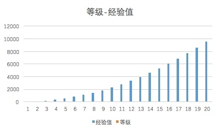

# 经验值、等级、悦币

## 经验值

玩家在悦盒的行为会积累经验值

### 经验值等级对应关系

等级的分割点： _50, 100, 200, 350, 550, 800, 1100, 1450, 1850, 2300, 2800,3350, 3950, 4600, 5300, 6050, 6850, 7700, 8600, 9550_

### 获取途径

* 完成挑战任务，获得任务的经验值奖励 
* 买卖卡牌等商品，获得奖励 
* 参加课堂battle，课堂表现获得的奖励 
* 悦盒系统内特殊活动，获得奖励 
* 达到特殊目标，赢得勋章奖励，获得经验值奖励 
* 邀请好友体验悦盒，获得经验值奖励 
* 其他

## 等级

等级代表了玩家取得的经验值所处的段位

### 用处

* 玩家使用卡牌时，卡牌本身要求玩家具备相应等级才可以启用 
* 玩家使用道具、开启故事卷轴、参与特殊活动、获得神秘体验邀请等，需达到相应等级 
* 玩家激活宠物，需要具备相应的等级 
* 玩家组建工会，需要具备相应的等级

## 悦币

悦盒系统内虚拟货币

### 用处

* 购买悦盒商店的商品 
* 兑换实物类奖品 
* 购买课程内容 
* 购买店内商品 
* 其他

### 获取方式

* 完成挑战任务，获得任务的经验值奖励 
* 买卖卡牌等商品，获得奖励 
* 参加课堂battle，课堂表现获得的奖励 
* 悦盒系统内特殊活动，获得奖励 
* 达到特殊目标，赢得勋章奖励，获得经验值奖励 
* 邀请好友体验悦盒，获得经验值奖励 
* 其他

