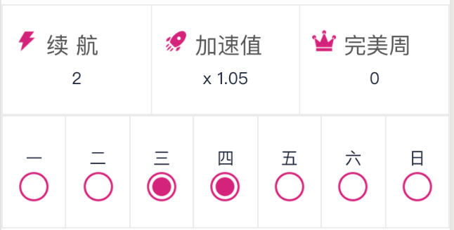

# 周排名、完美周、加速值

**keepBar**

统计玩家在每一周里坚持完成任务/挑战的情况

主要目的是培养玩家坚持完成挑战，形成习惯，独立自主学习知识，积累优势。

## 完美周

一周时间中**不少于5天**每天均完成了挑战

## 加速值

依据完成任务后，导师的评价来动态调整加速值。

1.每提交一个任务给导师审核，导师批改后，给出评分ABCDE五档，A对应5星最棒，E对应1星未提交作业。

| 得分 | 加速值 | 备注 |
| :---: | :---: | :---: |
| A | +30% | 太棒了，完美 |
| B | +5% | 优秀，棒 |
| C | +1% | 还行 |
| D | -5% | 有点差啊，审错题啦 |
| E | -15% | 没交作业 |

2. 加速效果

在下一次提交任务获得积分或者悦币奖励的时候，直接按照加速值来计算。例如任务1完成后可以获得10个悦币，加速值是50%的话，那么可以额外获得5个悦币。

3. 加速值的保留和清零

* 如果当周是完美周，那么加速值可以保留，下一周不用从0开始累积。
* 如果当周不是完美周，那么下周开始的时候，加速值从0开始。

4. 加速值**最小值**是0

